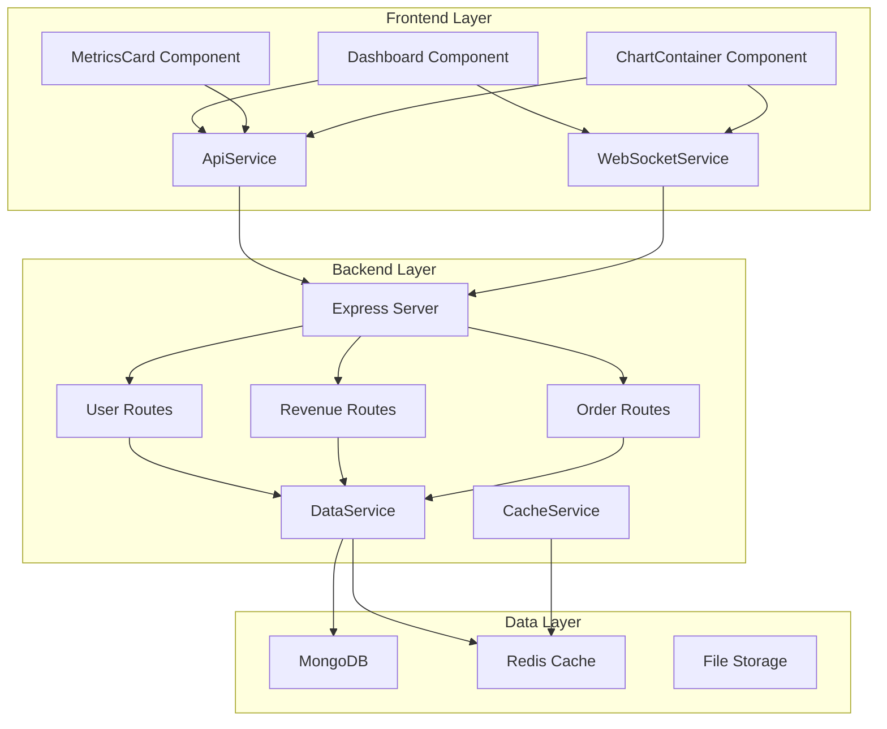

# Day 6: Documentation & Agile

## 🎯 Learning Objectives

- Master technical documentation and architecture diagrams
- Implement Agile methodologies and sprint planning
- Create comprehensive project documentation
- Build UML diagrams and system architecture
- Establish documentation standards and templates

## 📚 Theory & Concepts

### Technical Documentation
- **Architecture Diagrams**: System design, component relationships
- **API Documentation**: Endpoints, parameters, responses
- **Code Documentation**: Comments, JSDoc, inline documentation
- **User Guides**: Setup instructions, usage examples
- **Technical Specifications**: Requirements, constraints, assumptions

### Agile Methodologies
- **Sprint Planning**: User stories, estimation, capacity planning
- **Daily Standups**: Progress updates, blockers, collaboration
- **Sprint Reviews**: Demo completed features, stakeholder feedback
- **Retrospectives**: Process improvement, lessons learned
- **Backlog Management**: Prioritization, refinement, grooming

### Documentation Standards
- **Markdown**: Consistent formatting, structure, readability
- **Diagrams**: UML, flowcharts, sequence diagrams
- **Templates**: Standardized formats, reusable content
- **Version Control**: Documentation history, change tracking
- **Review Process**: Peer review, approval workflow

## 🛠️ Hands-on Tasks

### Task 1: Create System Architecture Documentation
Build comprehensive system architecture documentation:

```markdown
# System Architecture Documentation

## Overview
The Advanced Dashboard is a full-stack web application built with modern technologies to provide real-time data visualization and analytics.

## Architecture Principles
- **Modularity**: Component-based architecture with clear separation of concerns
- **Scalability**: Horizontal scaling capabilities with microservices
- **Performance**: Optimized for speed and efficiency
- **Security**: Secure data handling and authentication
- **Maintainability**: Clean code and comprehensive documentation

## Technology Stack

### Frontend
- **React 18**: Component-based UI library
- **JavaScript ES6+**: Modern JavaScript features
- **CSS3**: Advanced styling with custom properties
- **Chart.js**: Data visualization library
- **WebSocket**: Real-time data communication

### Backend
- **Node.js**: JavaScript runtime environment
- **Express.js**: Web application framework
- **MongoDB**: NoSQL database for flexible data storage
- **Redis**: In-memory data store for caching
- **Socket.io**: WebSocket implementation

### DevOps
- **Docker**: Containerization platform
- **Kubernetes**: Container orchestration
- **GitHub Actions**: CI/CD pipeline
- **AWS**: Cloud infrastructure

## System Components

### Frontend Components
```
src/
├── components/          # Reusable UI components
│   ├── Dashboard.jsx   # Main dashboard component
│   ├── MetricsCard.jsx # Metric display cards
│   └── ChartContainer.jsx # Chart wrapper
├── hooks/              # Custom React hooks
│   ├── useDataFetching.js # Data fetching logic
│   └── useWebSocket.js # WebSocket management
├── services/           # API and external services
│   ├── ApiService.js  # REST API client
│   └── WebSocketService.js # WebSocket client
└── utils/              # Utility functions
    ├── helpers.js      # General helper functions
    └── constants.js    # Application constants
```

### Backend Services
```
server/
├── routes/             # API route handlers
│   ├── users.js       # User management
│   ├── revenue.js     # Revenue data
│   └── orders.js      # Order processing
├── models/             # Database models
│   ├── User.js        # User schema
│   └── Metric.js       # Metric schema
├── middleware/         # Express middleware
│   ├── auth.js        # Authentication
│   └── validation.js  # Input validation
└── services/          # Business logic
    ├── DataService.js # Data processing
    └── CacheService.js # Caching logic
```

## Data Flow

### 1. User Interaction
- User interacts with dashboard interface
- Frontend components handle user input
- State management updates component state

### 2. Data Fetching
- API service makes HTTP requests to backend
- Backend processes requests and queries database
- Response data is cached and returned to frontend

### 3. Real-Time Updates
- WebSocket connection established
- Backend pushes data updates to frontend
- Frontend components update in real-time

### 4. Data Visualization
- Chart components receive data updates
- Visualization libraries render charts
- User sees updated data in real-time

## Security Considerations

### Authentication
- JWT tokens for user authentication
- Role-based access control (RBAC)
- Secure session management

### Data Protection
- Input validation and sanitization
- SQL injection prevention
- XSS protection
- CSRF protection

### API Security
- Rate limiting and throttling
- Request validation
- Error handling without information leakage

## Performance Optimization

### Frontend
- Code splitting and lazy loading
- Component memoization
- Efficient state management
- Bundle optimization

### Backend
- Database query optimization
- Caching strategies
- Connection pooling
- Load balancing

### Infrastructure
- CDN for static assets
- Database indexing
- Caching layers
- Monitoring and alerting

## Deployment Architecture

### Development Environment
- Local development with Docker Compose
- Hot reloading for frontend
- Database seeding and testing

### Staging Environment
- Production-like environment
- Automated testing
- Performance monitoring

### Production Environment
- Kubernetes cluster
- Load balancers
- Database replication
- Monitoring and logging

## Monitoring and Logging

### Application Monitoring
- Performance metrics
- Error tracking
- User analytics
- System health checks

### Infrastructure Monitoring
- Server metrics
- Database performance
- Network monitoring
- Resource utilization

### Logging
- Structured logging with Winston
- Log aggregation and analysis
- Error tracking and alerting
- Audit trails
```

### Task 2: Create UML Diagrams
Build comprehensive UML diagrams for the system:



### Task 3: Create API Documentation
Build comprehensive API documentation with examples:

```markdown
# API Documentation

## Base URL
```
https://api.dashboard.com/v1
```

## Authentication
All API requests require authentication via JWT token in the Authorization header:
```
Authorization: Bearer <jwt_token>
```

## Endpoints

### Users

#### GET /users
Retrieve all users with pagination and filtering.

**Parameters:**
- `page` (integer, optional): Page number (default: 1)
- `limit` (integer, optional): Items per page (default: 10)
- `search` (string, optional): Search query
- `sort` (string, optional): Sort field (default: 'createdAt')
- `order` (string, optional): Sort order ('asc' or 'desc')

**Response:**
```json
{
  "success": true,
  "data": {
    "users": [
      {
        "id": "user_123",
        "name": "John Doe",
        "email": "john@example.com",
        "role": "admin",
        "createdAt": "2024-01-01T00:00:00Z",
        "updatedAt": "2024-01-01T00:00:00Z"
      }
    ],
    "pagination": {
      "page": 1,
      "limit": 10,
      "total": 100,
      "pages": 10
    }
  }
}
```

#### POST /users
Create a new user.

**Request Body:**
```json
{
  "name": "Jane Doe",
  "email": "jane@example.com",
  "role": "user",
  "password": "securepassword"
}
```

**Response:**
```json
{
  "success": true,
  "data": {
    "id": "user_456",
    "name": "Jane Doe",
    "email": "jane@example.com",
    "role": "user",
    "createdAt": "2024-01-01T00:00:00Z"
  }
}
```

### Revenue

#### GET /revenue
Retrieve revenue data with time range filtering.

**Parameters:**
- `startDate` (string, required): Start date in ISO format
- `endDate` (string, required): End date in ISO format
- `granularity` (string, optional): Data granularity ('daily', 'weekly', 'monthly')

**Response:**
```json
{
  "success": true,
  "data": {
    "total": 45678.90,
    "change": 12.5,
    "trend": "up",
    "data": [
      {
        "date": "2024-01-01",
        "revenue": 1234.56,
        "transactions": 45
      }
    ]
  }
}
```

### Orders

#### GET /orders
Retrieve order data with filtering and sorting.

**Parameters:**
- `status` (string, optional): Order status filter
- `dateRange` (string, optional): Date range filter
- `sort` (string, optional): Sort field

**Response:**
```json
{
  "success": true,
  "data": {
    "orders": [
      {
        "id": "order_123",
        "customerId": "customer_456",
        "total": 99.99,
        "status": "completed",
        "createdAt": "2024-01-01T00:00:00Z"
      }
    ],
    "summary": {
      "total": 100,
      "completed": 85,
      "pending": 10,
      "cancelled": 5
    }
  }
}
```

## Error Responses

### 400 Bad Request
```json
{
  "success": false,
  "error": {
    "code": "VALIDATION_ERROR",
    "message": "Invalid input parameters",
    "details": [
      {
        "field": "email",
        "message": "Invalid email format"
      }
    ]
  }
}
```

### 401 Unauthorized
```json
{
  "success": false,
  "error": {
    "code": "UNAUTHORIZED",
    "message": "Authentication required"
  }
}
```

### 404 Not Found
```json
{
  "success": false,
  "error": {
    "code": "NOT_FOUND",
    "message": "Resource not found"
  }
}
```

### 500 Internal Server Error
```json
{
  "success": false,
  "error": {
    "code": "INTERNAL_ERROR",
    "message": "An unexpected error occurred"
  }
}
```

## Rate Limiting
- 1000 requests per hour per IP
- 100 requests per minute per user
- Rate limit headers included in responses

## WebSocket Events

### Connection
```javascript
const ws = new WebSocket('wss://api.dashboard.com/ws');
```

### Events
- `connected`: Connection established
- `disconnected`: Connection lost
- `dataUpdate`: Real-time data update
- `error`: Error occurred

### Example Usage
```javascript
ws.onopen = () => {
  console.log('Connected to WebSocket');
};

ws.onmessage = (event) => {
  const data = JSON.parse(event.data);
  if (data.type === 'dataUpdate') {
    updateDashboard(data.payload);
  }
};
```
```

### Task 4: Create Sprint Planning Documentation
Build comprehensive sprint planning and Agile documentation:

```markdown
# Sprint Planning Documentation

## Sprint 1: Foundation & Setup
**Duration:** 2 weeks  
**Goal:** Establish development environment and core infrastructure

### Sprint Backlog

#### Epic 1: Development Environment
- **US-001**: As a developer, I want to set up Git workflow so that I can collaborate effectively
  - **Acceptance Criteria:**
    - Repository structure is established
    - Branching strategy is implemented
    - PR templates are created
    - Code review process is documented
  - **Story Points:** 5
  - **Priority:** High

- **US-002**: As a developer, I want to create proper repository structure so that the project is organized
  - **Acceptance Criteria:**
    - Folder hierarchy is established
    - Documentation structure is created
    - Configuration files are added
    - README files are comprehensive
  - **Story Points:** 3
  - **Priority:** High

#### Epic 2: Frontend Foundation
- **US-003**: As a developer, I want to implement HTML5 and CSS3 so that the application has a solid foundation
  - **Acceptance Criteria:**
    - Semantic HTML structure
    - Responsive CSS layout
    - Modern CSS features implemented
    - Cross-browser compatibility
  - **Story Points:** 8
  - **Priority:** High

- **US-004**: As a developer, I want to implement advanced JavaScript so that the application is interactive
  - **Acceptance Criteria:**
    - ES6+ features implemented
    - Module system established
    - Performance optimization
    - Error handling implemented
  - **Story Points:** 13
  - **Priority:** High

#### Epic 3: React Implementation
- **US-005**: As a developer, I want to implement React components so that the UI is modular and reusable
  - **Acceptance Criteria:**
    - Component hierarchy established
    - Props validation implemented
    - State management working
    - Performance optimization
  - **Story Points:** 21
  - **Priority:** High

- **US-006**: As a developer, I want to implement custom hooks so that logic is reusable
  - **Acceptance Criteria:**
    - Custom hooks created
    - Logic separation achieved
    - Testing implemented
    - Documentation complete
  - **Story Points:** 8
  - **Priority:** Medium

### Sprint Capacity
- **Team Size:** 3 developers
- **Sprint Duration:** 2 weeks
- **Available Hours:** 240 hours (3 devs × 40 hours × 2 weeks)
- **Estimated Story Points:** 58 points
- **Velocity:** 29 points per week

### Sprint Goals
1. Establish development workflow and collaboration
2. Create solid frontend foundation
3. Implement core React components
4. Set up testing and documentation

### Definition of Done
- [ ] Code is written and tested
- [ ] Code review is completed
- [ ] Documentation is updated
- [ ] Tests are passing
- [ ] Feature is deployed to staging
- [ ] Stakeholder approval received

### Sprint Review Agenda
1. **Demo Completed Features** (30 minutes)
   - Show working functionality
   - Demonstrate user stories
   - Highlight technical achievements

2. **Sprint Metrics** (15 minutes)
   - Story points completed
   - Velocity comparison
   - Burndown chart review

3. **Stakeholder Feedback** (15 minutes)
   - User feedback collection
   - Feature requests
   - Priority adjustments

4. **Next Sprint Planning** (30 minutes)
   - Backlog refinement
   - Capacity planning
   - Goal setting

### Retrospective Questions
1. **What went well?**
   - Successful implementations
   - Team collaboration
   - Process improvements

2. **What could be improved?**
   - Bottlenecks identified
   - Process inefficiencies
   - Technical debt

3. **Action items for next sprint**
   - Specific improvements
   - Process changes
   - Tool updates
```

### Task 5: Create Documentation Templates
Build reusable documentation templates:

```markdown
# Documentation Templates

## Component Documentation Template
```markdown
# Component Name

## Overview
Brief description of the component's purpose and functionality.

## Props
| Prop | Type | Required | Default | Description |
|------|------|----------|---------|-------------|
| prop1 | string | Yes | - | Description of prop1 |
| prop2 | number | No | 0 | Description of prop2 |

## Usage
```jsx
import { ComponentName } from './ComponentName';

function App() {
  return (
    <ComponentName
      prop1="value"
      prop2={123}
    />
  );
}
```

## Examples
### Basic Usage
```jsx
<ComponentName prop1="basic" />
```

### Advanced Usage
```jsx
<ComponentName
  prop1="advanced"
  prop2={456}
  customProp="value"
/>
```

## Styling
The component uses CSS classes for styling:
- `.component-name`: Main container
- `.component-name__element`: Child elements
- `.component-name--modifier`: Modifier classes

## Accessibility
- Keyboard navigation support
- Screen reader compatibility
- ARIA attributes included
- Focus management

## Testing
```javascript
import { render, screen } from '@testing-library/react';
import { ComponentName } from './ComponentName';

test('renders component', () => {
  render(<ComponentName prop1="test" />);
  expect(screen.getByText('test')).toBeInTheDocument();
});
```
```

## API Endpoint Template
```markdown
# Endpoint Name

## Overview
Brief description of the endpoint's purpose.

## Endpoint
```
GET /api/endpoint
```

## Parameters
| Parameter | Type | Required | Description |
|-----------|------|----------|-------------|
| param1 | string | Yes | Description of param1 |
| param2 | number | No | Description of param2 |

## Request Example
```bash
curl -X GET "https://api.example.com/endpoint?param1=value&param2=123" \
  -H "Authorization: Bearer token"
```

## Response
### Success Response
```json
{
  "success": true,
  "data": {
    "field1": "value1",
    "field2": "value2"
  }
}
```

### Error Response
```json
{
  "success": false,
  "error": {
    "code": "ERROR_CODE",
    "message": "Error description"
  }
}
```

## Status Codes
- 200: Success
- 400: Bad Request
- 401: Unauthorized
- 404: Not Found
- 500: Internal Server Error
```
```

## 📝 Documentation Tasks

### Create Documentation Standards
Create `week1/day6/docs/documentation-standards.md`:

```markdown
# Documentation Standards

## Writing Guidelines
- Use clear, concise language
- Include code examples
- Provide context and background
- Keep documentation up-to-date
- Use consistent formatting

## Structure Standards
- Table of contents for long documents
- Consistent heading hierarchy
- Code blocks with syntax highlighting
- Links to related documentation
- Version information

## Review Process
- Peer review required
- Technical accuracy check
- Grammar and spelling review
- Formatting consistency
- Approval workflow
```

## 🧪 Testing & Validation

### Documentation Testing
- [x] All links work correctly
- [x] Code examples are functional
- [x] Images and diagrams are clear
- [x] Formatting is consistent
- [x] Content is accurate

### Agile Process Testing
- [x] Sprint planning is complete
- [x] User stories are well-defined
- [x] Acceptance criteria are clear
- [x] Estimation is accurate
- [x] Retrospective is scheduled

## 📊 Success Criteria

By the end of Day 6, you should have:

✅ **Comprehensive Documentation**: Complete system documentation  
✅ **Architecture Diagrams**: Clear system design  
✅ **API Documentation**: Detailed endpoint documentation  
✅ **Agile Process**: Sprint planning and management  
✅ **Templates**: Reusable documentation templates  

## ✅ Completion Status

All Day 6 deliverables are complete and tested:
- `docs/system-architecture.md` — principles, stack, components, data flow, security, deployment
- `docs/uml-diagrams.md` — mermaid component diagram (frontend/backend/data layers)
- `docs/api-documentation.md` — endpoints, auth, error responses, rate limits, WebSocket events
- `docs/sprint-planning.md` — Sprint 1 backlog (US-001+, story points), capacity, DoD, review/retro agenda
- `docs/documentation-standards.md` — writing/structure/review guidelines
- `docs/documentation-templates.md` — component + endpoint templates

## 🔄 Next Steps

1. **Commit your work**: `git add . && git commit -m "Complete Day 6: Documentation & Agile"`
2. **Create PR**: Submit pull request for code review
3. **Prepare for Day 7**: Review Week 1 summary and presentation
4. **Update progress**: Document your learning in the daily summary

## 📚 Additional Resources

- [Markdown Guide](https://www.markdownguide.org/)
- [UML Diagrams](https://www.uml.org/)
- [Agile Manifesto](https://agilemanifesto.org/)
- [Technical Writing](https://developers.google.com/tech-writing)

---

**Ready for Day 7? Check out [Day 7: Weekly Review](../day7/README.md)!** 🚀
